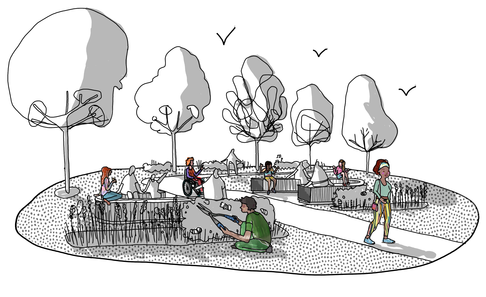

# Welcome to the Safer Parks Dashboard!

[Supporting safer, more inclusive parks for women and girls]{.emphasis}

::::{.grid}

::: {.g-col-12 .g-col-md-6 .align-items-center}

 

:::::{.larger-bullets}
- Visualise park safety factors
- Explore spatial data layers
- Make decisions with evidence
- Create safer parks in your area
:::::

:::

::: {.g-col-12 .g-col-md-6 .align-items-center}
{fig-align="center" width="100%"}
:::

::::

::::{.d-flex .justify-content-center}
[Register to access the dashboard](https://na01.safelinks.protection.outlook.com/?url=https%3A%2F%2Fforms.cloud.microsoft%2FPages%2FResponsePage.aspx%3Fid%3DqO3qvR3IzkWGPlIypTW3y_21PdTtSidAqW-TSzvWOgxUMzk3UlRYQjJXTUMwNlQyVk1RREUxVjM1Qy4u&data=05%7C02%7C%7Ca12ccb7fa0fe445c7a7508df1efa6611%7C84df9e7fe9f640afb435aaaaaaaaaaaa%7C1%7C0%7C639263732943170416%7CUnknown%7CTWFpbGZsb3d8eyJFbXB0eU1hcGkiOnRydWUsIlYiOiIwLjAuMDAwMCIsIlAiOiJXaW4zMiIsIkFOIjoiTWFpbCIsIldUIjoyfQ%3D%3D%7C0%7C%7C%7C&sdata=s5tWC7RH%2B3qM5xB6FXmxefbxXvlrComEvu52l%2F1Xjlc%3D&reserved=0){.btn .btn-primary .btn-lg .rounded-pill}
::::

 

<!-- ::: {.text-box}

[Access the dashboard]{.emphasis}

In order to access the dashboard, you must complete a brief registration form. This allows us to maintain internal records and improve our service.

 

  
Warranty and liability (click to expand)

  The software is provided "as is", without warranty of any kind, express or implied, including but not limited to the warranties of merchantability, fitness for a particular purpose and noninfringement. In no event shall the authors or copyright holders be liable for any claim, damages or other liability, whether in an action of contract, tort or otherwise, arising from, out of or in connection with the software or the use or other dealings in the software.

::: -->

 

:::{.text-box2}
The Safer Parks Dashboard helps local authorities, police forces, and community partners understand the environmental and social factors that shape how safe women and girls feel in parks.

It brings together open spatial data on the indicators that matter most, including lighting, visibility, entrances and escape routes, crime patterns, footfall, and park facilities.

Aligned with the [*Safer Parks: Improving Access to Women and Girls* guidance](https://eprints.whiterose.ac.uk/id/eprint/229530/1/250908_Safer%20Parks_PCPI_Single.pdf), the dashboard provides a clear evidence base to support better design, management, and prevention activity.

Explore the data to see how this tool can support your work in creating parks that feel welcoming, inclusive, and safe for everyone.

  
Warranty and liability (click to expand)

  The software is provided "as is", without warranty of any kind, express or implied, including but not limited to the warranties of merchantability, fitness for a particular purpose and noninfringement. In no event shall the authors or copyright holders be liable for any claim, damages or other liability, whether in an action of contract, tort or otherwise, arising from, out of or in connection with the software or the use or other dealings in the software.

:::

Hero section illustration credit: [Harper Perry](www.harperperry.co.uk).

