## Research Team

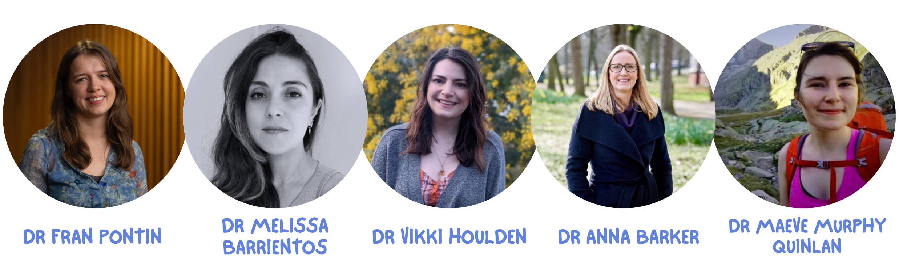{fig-align="center" width="100%" alt="Safer Parks Dashboard research team"}

[Collaboration driving safer public spaces ]{.emphasis}

In addition to the core research team, the Safer Parks Dashboard has been shaped through close collaboration with organisations committed to improving safety, access, and inclusion in parks. 

The work has been assisted by partners, funders, and supporters, who have provided expertise, resources, and guidance throughout the project. Their contributions have been invaluable in ensuring that the dashboard reflects the needs and priorities of communities across West Yorkshire.

## Partners

::: {.carousel}

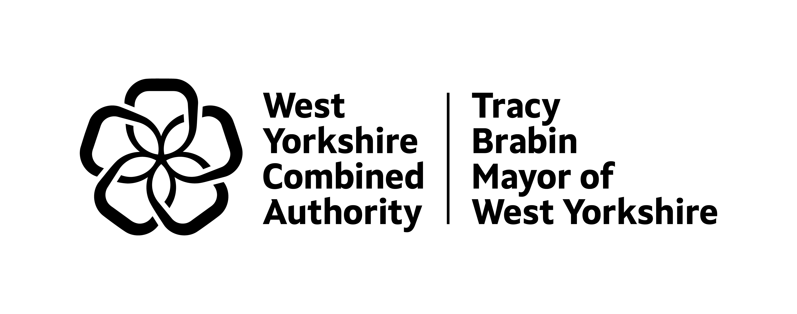{fig-align="center" width="100%" alt="West Yorkshire Combined Authority logo"}

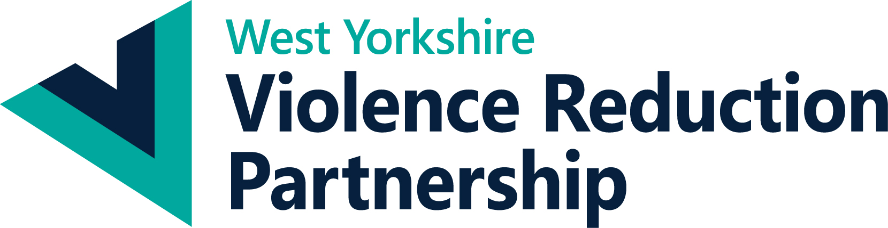{fig-align="center" width="100%" alt="West Yorkshire Violence Reduction Partnership logo"}

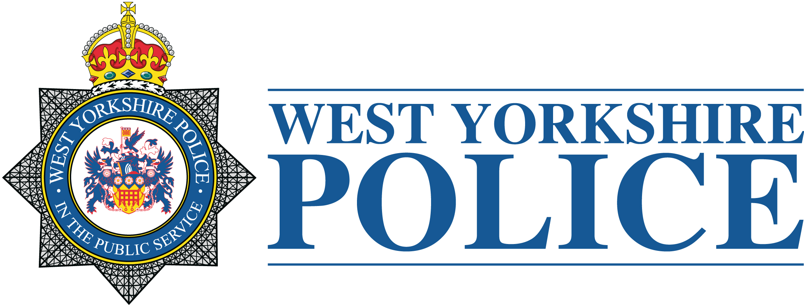{fig-align="center" width="100%" alt="West Yorkshire Police logo"}

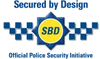{fig-align="center" width="100%" alt="Secured by Design logo"}

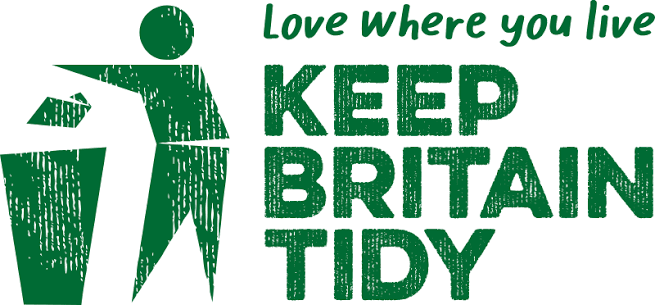{fig-align="center" width="100%" alt="Keep Britain Tidy logo"}

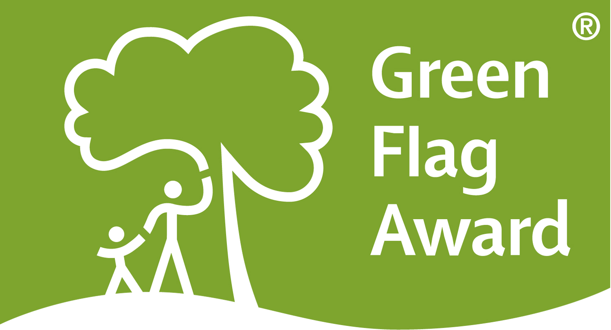{fig-align="center" width="100%" alt="Green Flag Award logo"}

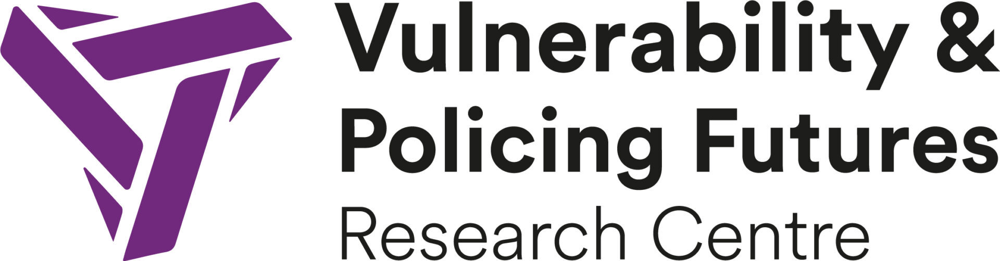{fig-align="center" width="100%" alt="Vulnerability and Policing Research Centre logo"}

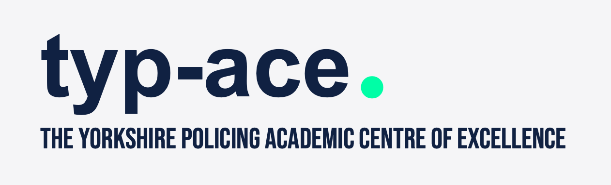{fig-align="center" width="100%"}

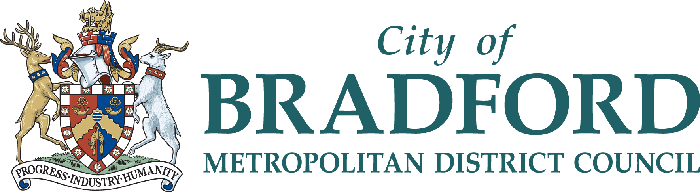{fig-align="center" width="100%" alt="Bradford Council logo"}

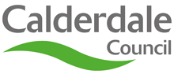{fig-align="center" width="100%" alt="Calderdale Council logo"}

{fig-align="center" width="100%" alt="Kirklees Council logo"}

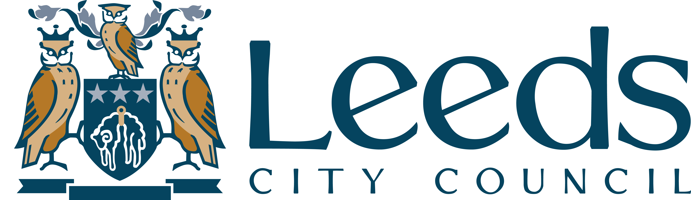{fig-align="center" width="100%" alt="Leeds Council logo"}

{fig-align="center" width="100%" alt="Wakefield Council logo"}

:::

## Funders

::: {.carousel2}

{fig-align="center" width="100%" alt="Research England logo"}

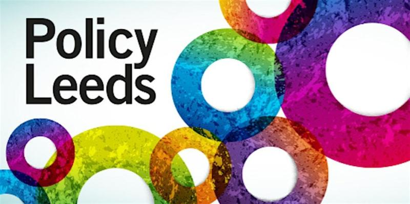{fig-align="center" width="100%" alt="Policy Leeds logo"}

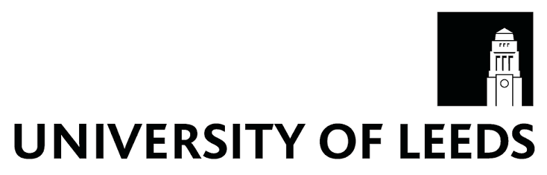{fig-align="center" width="100%" alt="University of Leeds logo"}

:::

## Illustrations and brand identity

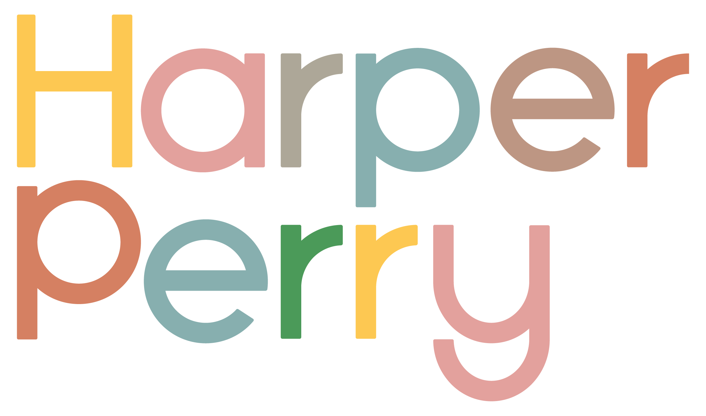{fig-align="center" width="25%" alt="Harper Perry logo"}

## Supporters

If you are taking part in the pilot study, and are happy for your logo to be shown here, please let us know!

